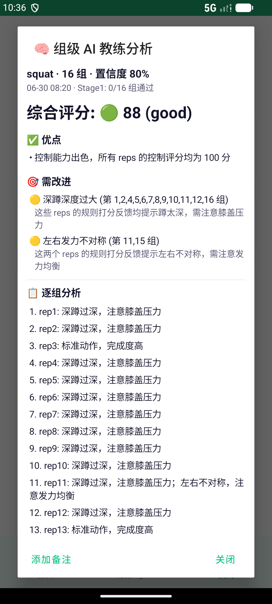
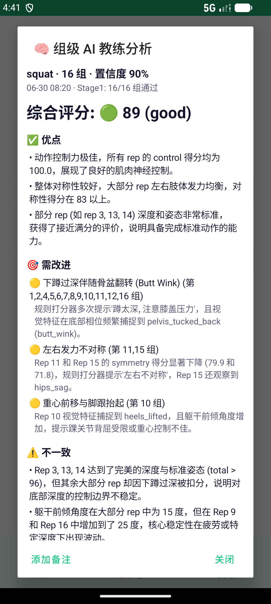
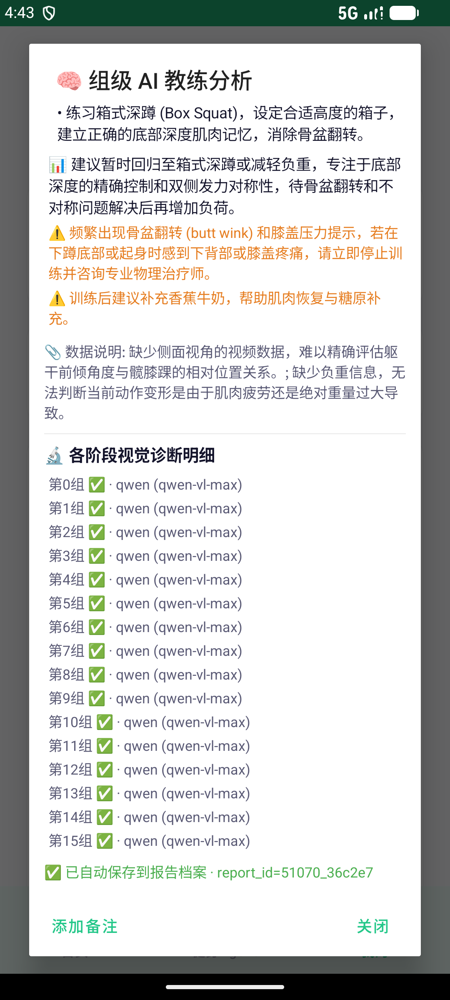

# Smart Fitness Guidance System

**智能健身指导系统** — AI-powered real-time exercise coaching system built on a single ESP32-CAM (AI-Thinker, with an OV2640 camera module), a Windows/macOS/Linux backend, and an Android companion app.

## Screenshots

| Home dashboard | AI-coach reminder inbox | Reminder detail |
|---|---|---|
|  |  |  |

### AI-coach report (Stage-2 LLM upgrade)

Same squat session, before and after switching Stage-2 to the Aliyun Bailian 2026 flagship chain (`qwen3.7-max` primary, 6000 reasoning tokens). Both screenshots below were captured live from the emulator on 2026-07-06.

| **Before** · `qwen-plus` (2024, 1400 tok) | **After (summary)** · `qwen3.7-max` (2026, 6000 tok) | **After (detail)** · `qwen3.7-max` |
|---|---|---|
|  |  |  |
| Score 88 · short paragraphs · no regression drills · no preference-aware cautions | Score 89 · named rep callouts (`Rep 3/13/14 perfect depth`, `Rep 11/15 pelvic rotation`) · per-set inconsistency flags | Concrete regression plan (**回归箱式深蹲 / 减轻负重**), pain-warning, and USER.md-aware nutrition tip (**香蕉牛奶** — pulled from the "爱喝高碳水饮品" preference) + 16-group `qwen-vl-max` visual diagnostics |

The live Stage-2 provider chain (see `backend/fitness_agent/vision_pipeline.py`):

```
bailian-qwen3-7-max            ← primary (2026 flagship, 6k reasoning budget)
bailian-kimi-k2-7-code         ← long-context backup
bailian-deepseek-v4-pro        ← deep-reasoning backup
bailian-qwen3-6-flash          ← fast lane
bailian-deepseek-v4-flash      ← fast lane
qwen (qwen-plus, legacy key)   ← compat
volc-coding (doubao Seed 1.6)  ← fallback
volc / volc-legacy             ← last resort
```

## Architecture Overview

```
┌────────────────────────────────────────────────────────────┐
│                    Edge Camera Node                        │
│                                                            │
│                 ┌──────────────┐                           │
│                 │  OV2640      │  camera module            │
│                 │  Camera      │                           │
│                 └──────┬───────┘                           │
│                        │ DVP                               │
│                 ┌──────┴───────┐                           │
│                 │  ESP32-CAM   │  AI-Thinker board         │
│                 │  (WiFi MCU)  │  MJPEG + HTTP POST        │
│                 └──────┬───────┘                           │
└────────────────────────┼───────────────────────────────────┘
                         │ WiFi (HTTP + WebSocket)
┌────────────────────────┼───────────────────────────────────┐
│                 ┌──────┴───────┐   Local backend (PC)      │
│                 │  FastAPI     │                           │
│                 │  (v2 REST +  │                           │
│                 │   WS + MQTT) │                           │
│                 └──────┬───────┘                           │
│                        │                                   │
│    ┌───────────────────┼───────────────────┐               │
│    │                   │                   │               │
│ ┌──┴──────────┐  ┌─────┴─────┐  ┌──────────┴──────────┐    │
│ │ Pose engine │  │ Rep score │  │ AI-coach two-stage  │    │
│ │ (MediaPipe /│  │ + quality │  │  vision → LLM chain │    │
│ │  YOLO26)    │  │ (evidence)│  │  (Aliyun Bailian /  │    │
│ └─────────────┘  └───────────┘  │   Volc Ark / etc.)  │    │
│                                 └─────────────────────┘    │
└────────────────────────────────────────────────────────────┘
                         │ HTTP / WebSocket
                 ┌───────┴────────┐
                 │  Android app   │
                 │  (Kotlin)      │
                 └────────────────┘
```

## Project Structure

```
smart_fitness/
├── ai_vision/          # AI Vision Module (MediaPipe Pose)
│   ├── pose_engine.py       # Pose estimation core
│   ├── exercise_detector.py # Exercise classification & rep counting
│   ├── form_analyzer.py     # Form quality analysis
│   ├── demo_app.py          # Real-time demo (webcam/video)
│   ├── test_pose.py         # Unit tests
│   └── requirements.txt     # Python dependencies
├── backend/            # Backend Server (FastAPI)
│   ├── main.py              # FastAPI application entry
│   ├── mqtt_client.py       # MQTT client handler
│   ├── models.py            # Data models
│   ├── requirements.txt     # Python dependencies
│   └── Dockerfile           # Container build
├── edge_esp32cam/      # ESP32-CAM firmware (Arduino IDE)
│   ├── esp32cam_fitness/    # Main firmware sketch
│   ├── camera_probe/        # Camera bring-up sketch
│   ├── camera_test/         # Standalone camera test
│   └── FLASH_GUIDE.md       # Flashing instructions
├── tests/              # Integration & performance tests
│   ├── test_integration.py   # End-to-end integration tests
│   └── test_performance.py   # Performance benchmarks
├── docs/               # Documentation
│   ├── original_report.txt   # Original design report
│   ├── deployment_guide.md   # Full deployment guide
│   └── 技术方案报告.md        # Chinese technical report
├── docker-compose.yml   # Docker compose orchestration
├── README.md            # This file
└── .gitignore
```

## Quick Start

### Prerequisites
- Python 3.10+
- ESP32-CAM (AI-Thinker board with OV2640 camera module)
- Arduino IDE 2.x with the ESP32 core installed (for firmware flashing)

### 1. AI Vision (Local PC)
```bash
cd ai_vision
pip install -r requirements.txt
python demo_app.py                    # Webcam mode
python demo_app.py --video test.mp4   # Video file mode
```

### 2. Backend Server
```bash
cd backend
pip install -r requirements.txt
python main.py                        # Start FastAPI server
```

### 3. ESP32-CAM Firmware
```
# Open edge_esp32cam/esp32cam_fitness/esp32cam_fitness.ino in Arduino IDE
# Board: AI Thinker ESP32-CAM
# Fill in WiFi SSID / password and the backend URL, then Upload.
# See edge_esp32cam/FLASH_GUIDE.md for the full walkthrough.
```

### 4. Full Stack with Docker
```bash
docker-compose up -d                   # Backend + MQTT broker
```

## Phone PWA (Phase 2)

手机端渐进式 Web 应用，通过 WebSocket 实现实时姿态检测 + 骨骼叠加渲染。

### 手机访问
```
1. 确保手机与 PC 同 WiFi
2. PC 上启动后端：cd backend && python main.py
3. 手机浏览器打开 http://<PC-LAN-IP>:8080/static/index.html
4. 点击「开始训练」→ 授权摄像头 → 实时姿态检测
```

**PWA 功能：**
- 🏋️ 实时姿态检测（WebSocket 3FPS 帧流）
- 🦴 Canvas 骨骼叠加（33 个关键点 + 连接线）
- ⭐ 姿势评分（100 分制，绿/黄/红颜色）
- 🔢 动作计数（俯卧撑/深蹲/弓步/弯举/肩推）
- 🎯 动作选择器（8 种动作可选）
- 📱 PWA 可安装到桌面
- 🔄 断线自动重连
- 🌐 服务器 IP 自动检测

## Flutter 移动端 APP (Phase 3 — 规划中)

完整的架构方案见 `docs/flutter_app_plan.md`。

| 阶段 | 内容 | 状态 |
|------|------|------|
| Phase 1 | 动作选择 + 评分引擎改进 | ✅ 完成 |
| Phase 2 | 手机 PWA WebSocket 实时检测 | ✅ 完成 |
| Phase 3 | Flutter 原生安卓 APP + 用户体系 | 📋 已规划 |

**Phase 3 技术栈：**
- Flutter 3.x + `google_ml_kit_pose_detection`（手机本地推理）
- `flutter_bloc` 状态管理 + `dio` HTTP + `drift` 离线 SQLite
- JWT 认证 + PC↔手机跨端同步

## Hardware Bill of Materials

The current build only uses one board and its bundled camera module. Everything else runs on the host PC and the Android phone.

| Component | Model | Cost | Interface |
|-----------|-------|------|-----------|
| Camera Node | AI-Thinker ESP32-CAM (ESP32-S with 4 MB PSRAM) | ~35 CNY | WiFi |
| Camera Module | OV2640 (bundled with the ESP32-CAM board) | included | DVP |
| USB-to-Serial Downloader | CH340 / CP2102 programmer | ~10 CNY | USB |
| **Total** | | **~45 CNY** | |

Other sensors that were sketched in early design drafts (heart-rate MAX30102, MPU-6050 IMU, MSM261 microphone, MAX98357 speaker) are **not part of the current hardware** — pose estimation and rep quality run entirely from the camera stream.

## Key Open Source Frameworks

| Framework | Purpose | License | Source |
|-----------|---------|---------|--------|
| MediaPipe Pose | Pose estimation (33 landmarks) | Apache 2.0 | https://github.com/google/mediapipe |
| OpenCV | Image processing & display | Apache 2.0 | https://github.com/opencv/opencv |
| FastAPI | Backend REST API | MIT | https://github.com/tiangolo/fastapi |
| Mosquitto | MQTT message broker | EPL 2.0 | https://github.com/eclipse/mosquitto |
| PubSubClient | ESP32 MQTT client | MIT | https://github.com/knolleary/pubsubclient |
| ArduinoJson | ESP32 JSON serialization | MIT | https://github.com/bblanchon/ArduinoJson |
| Arduino-ESP32 | ESP32 Arduino core | LGPL 2.1 | https://github.com/espressif/arduino-esp32 |

## License

Apache 2.0
