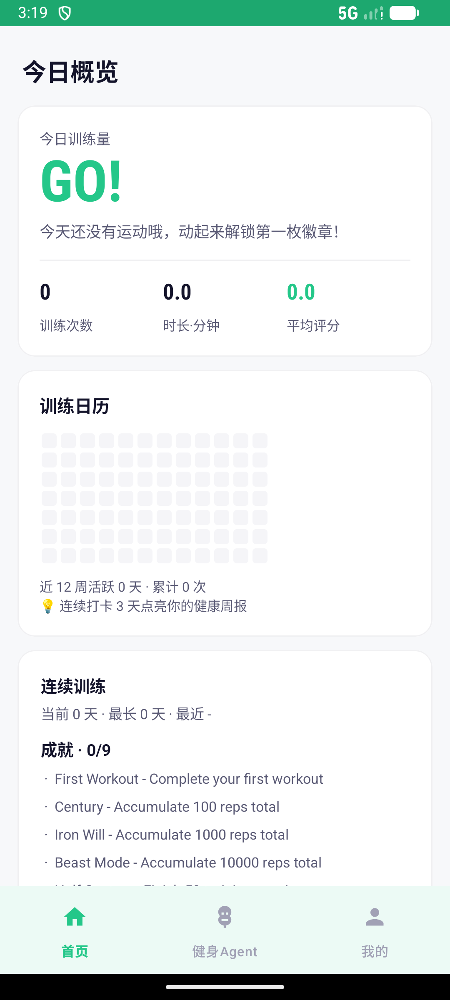

# Smart Fitness Guidance System

**智能健身指导系统** — AI-powered real-time exercise coaching system with computer vision and IoT sensors.

## Screenshots

| Home dashboard | AI-coach reminder inbox | Reminder detail |
|---|---|---|
|  |  |  |

### AI-coach report (Stage-2 LLM upgrade)

Same training session, three generations of Stage-2 reasoning model — you can literally see the report get sharper:

| v1 · `qwen-plus` (2024, 1400 tok) | v2 · `doubao-seed-1-6-pro` (1400 tok) | v3 · `qwen3.7-max` (2026, 6000 tok) |
|---|---|---|
|  |  |  |
| Generic tips | Coach-style advice | Per-rep numeric diagnostics (`depth 82.8°`, `trunk lean 30°`), concrete regression drills (box squat / goblet squat), and user-preference-aware cautions |

The live Stage-2 provider chain (see `backend/fitness_agent/vision_pipeline.py`):

```
bailian-qwen3-7-max            ← primary (2026 flagship, 6k reasoning budget)
bailian-kimi-k2-7-code         ← long-context backup
bailian-deepseek-v4-pro        ← deep-reasoning backup
bailian-qwen3-6-flash          ← fast lane
bailian-deepseek-v4-flash      ← fast lane
qwen (qwen-plus, legacy key)   ← compat
volc-coding (doubao Seed 1.6)  ← fallback
volc / volc-legacy             ← last resort
```

## Architecture Overview

```
┌─────────────────────────────────────────────────────────┐
│                  Perception Layer (ESP32-S3)              │
│  ┌─────────┐ ┌──────────┐ ┌──────────┐ ┌───────────┐   │
│  │ OV5640  │ │ MAX30102 │ │ MPU-6060 │ │ MSM261S4030│  │
│  │ Camera  │ │ HR Sensor│ │ 6-axis   │ │ Microphone│   │
│  └────┬────┘ └────┬─────┘ └────┬─────┘ └─────┬─────┘   │
│       └───────────┴────────────┴──────────────┘          │
│                        │ I2C / I2S                       │
│                 ┌──────┴──────┐                          │
│                 │ ESP32-S3 MCU │ ← WiFi + MQTT           │
│                 └──────┬──────┘                          │
└────────────────────────┼─────────────────────────────────┘
                         │ MQTT over TLS
┌────────────────────────┼─────────────────────────────────┐
│                 ┌──────┴──────┐     Edge PC (Local)        │
│                 │  Mosquitto  │                           │
│                 │  MQTT Broker│                           │
│                 └──────┬──────┘                           │
│                        │                                  │
│              ┌─────────┴─────────┐                       │
│              │   FastAPI Server   │                       │
│              │  (Pose + MQTT API) │                       │
│              └─────────┬─────────┘                       │
│                        │                                  │
│              ┌─────────┴─────────┐                       │
│              │  MediaPipe Pose    │ ← AI Vision Engine    │
│              └───────────────────┘                       │
└──────────────────────────────────────────────────────────┘
```

## Project Structure

```
smart_fitness/
├── ai_vision/          # AI Vision Module (MediaPipe Pose)
│   ├── pose_engine.py       # Pose estimation core
│   ├── exercise_detector.py # Exercise classification & rep counting
│   ├── form_analyzer.py     # Form quality analysis
│   ├── demo_app.py          # Real-time demo (webcam/video)
│   ├── test_pose.py         # Unit tests
│   └── requirements.txt     # Python dependencies
├── backend/            # Backend Server (FastAPI)
│   ├── main.py              # FastAPI application entry
│   ├── mqtt_client.py       # MQTT client handler
│   ├── models.py            # Data models
│   ├── requirements.txt     # Python dependencies
│   └── Dockerfile           # Container build
├── edge_device/        # ESP32-S3 Firmware (Arduino/PlatformIO)
│   ├── platformio.ini       # PlatformIO configuration
│   ├── include/config.h     # System configuration
│   └── src/                 # Firmware source code
│       ├── main.cpp             # Main entry point
│       ├── camera_utils.h       # OV5640 camera driver
│       ├── sensor_manager.h     # MAX30102 + MPU-6060 drivers
│       └── mqtt_manager.h       # MQTT communication
├── hardware/           # Hardware documentation
│   └── README.md            # Hardware connection guide
├── tests/              # Integration & performance tests
│   ├── test_integration.py   # End-to-end integration tests
│   └── test_performance.py   # Performance benchmarks
├── docs/               # Documentation
│   ├── original_report.txt   # Original design report
│   ├── deployment_guide.md   # Full deployment guide
│   └── 技术方案报告.md        # Chinese technical report
├── docker-compose.yml   # Docker compose orchestration
├── README.md            # This file
└── .gitignore
```

## Quick Start

### Prerequisites
- Python 3.10+
- ESP32-S3-CAM (with OV5640) + sensors
- PlatformIO (for firmware flashing)

### 1. AI Vision (Local PC)
```bash
cd ai_vision
pip install -r requirements.txt
python demo_app.py                    # Webcam mode
python demo_app.py --video test.mp4   # Video file mode
```

### 2. Backend Server
```bash
cd backend
pip install -r requirements.txt
python main.py                        # Start FastAPI server
```

### 3. ESP32 Firmware
```bash
cd edge_device
platformio run --target upload        # Flash firmware
platformio device monitor             # View serial output
```

### 4. Full Stack with Docker
```bash
docker-compose up -d                   # Backend + MQTT broker
```

## Phone PWA (Phase 2)

手机端渐进式 Web 应用，通过 WebSocket 实现实时姿态检测 + 骨骼叠加渲染。

### 手机访问
```
1. 确保手机与 PC 同 WiFi
2. PC 上启动后端：cd backend && python main.py
3. 手机浏览器打开 http://<PC-LAN-IP>:8080/static/index.html
4. 点击「开始训练」→ 授权摄像头 → 实时姿态检测
```

**PWA 功能：**
- 🏋️ 实时姿态检测（WebSocket 3FPS 帧流）
- 🦴 Canvas 骨骼叠加（33 个关键点 + 连接线）
- ⭐ 姿势评分（100 分制，绿/黄/红颜色）
- 🔢 动作计数（俯卧撑/深蹲/弓步/弯举/肩推）
- 🎯 动作选择器（8 种动作可选）
- 📱 PWA 可安装到桌面
- 🔄 断线自动重连
- 🌐 服务器 IP 自动检测

## Flutter 移动端 APP (Phase 3 — 规划中)

完整的架构方案见 `docs/flutter_app_plan.md`。

| 阶段 | 内容 | 状态 |
|------|------|------|
| Phase 1 | 动作选择 + 评分引擎改进 | ✅ 完成 |
| Phase 2 | 手机 PWA WebSocket 实时检测 | ✅ 完成 |
| Phase 3 | Flutter 原生安卓 APP + 用户体系 | 📋 已规划 |

**Phase 3 技术栈：**
- Flutter 3.x + `google_ml_kit_pose_detection`（手机本地推理）
- `flutter_bloc` 状态管理 + `dio` HTTP + `drift` 离线 SQLite
- JWT 认证 + PC↔手机跨端同步

## Hardware Bill of Materials

| Component | Model | Cost | Interface |
|-----------|-------|------|-----------|
| Camera Module | ESP32-S3-CAM-OV5640 | 51.8 CNY | DVP |
| HR Sensor | MAX30102 | 14.9 CNY | I2C |
| 6-axis IMU | MPU-6060 (MPU-6050) | 10.4 CNY | I2C |
| Microphone | MSM261S4030H0R | 35.0 CNY | I2S |
| Audio Amp+Speaker | MAX98357A+3W speaker | 7.8 CNY | I2S |
| **Total** | | **~120 CNY** | |

## Key Open Source Frameworks

| Framework | Purpose | License | Source |
|-----------|---------|---------|--------|
| MediaPipe Pose | Pose estimation (33 landmarks) | Apache 2.0 | https://github.com/google/mediapipe |
| OpenCV | Image processing & display | Apache 2.0 | https://github.com/opencv/opencv |
| FastAPI | Backend REST API | MIT | https://github.com/tiangolo/fastapi |
| Mosquitto | MQTT message broker | EPL 2.0 | https://github.com/eclipse/mosquitto |
| PubSubClient | ESP32 MQTT client | MIT | https://github.com/knolleary/pubsubclient |
| ArduinoJson | ESP32 JSON serialization | MIT | https://github.com/bblanchon/ArduinoJson |
| Arduino-ESP32 | ESP32 Arduino core | LGPL 2.1 | https://github.com/espressif/arduino-esp32 |

## License

Apache 2.0
